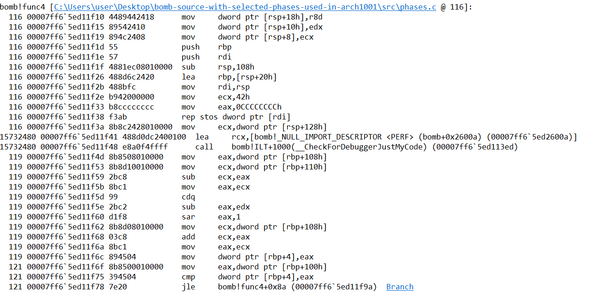

# BINARY-BOMB-LAB: FROM OPEN SECURITY 2
## EXPLAINATION:
You are given an .exe file, try to deduce what the program expects for input so the bomb doesnt explode! <br/>
There are 6 phases, with (probably) increasing difficulty.<br/>

## GUIDE:
Try to step over each line to understand the assembly instructions.
Ignore unnecessary blocks of instructions (stack overflow detection, etc.)

## PHASE 1:
- let's set a bp at main 1st and check out the asm code. <br/>
<p>
    
</p>

noteworthy instructions:
+ 2 printf and readline line (presumably for displaying some texts and reading required input from users. <br/>
+ the phase_x and phase_defused funct go hand in hand. <br/>
-> theory: phase_x funct will check for bomb in the x phase, if bomb -> explode, if not, move onto phase_defused and continue the next phase. <br/>

let's check out the phase_1 funct next. <br/>
<p>
    
</p>

we can see a call to (string_not_equal) (probably 4 comparing string), as well a lea (with symbol bomb!'string') and a mov above. <br/>
-> theory: these are ptrs to the required string and our input string, respectively. <br/>
we can use "da" (access memory and displaying them as ascii) -> giving us "I am just a renegade hockey mom." for rdx and our input for rcx. <br/>
-> our answer for phase_1: I am just a renegade hockey mom.

## PHASE 2:
let's check out phase_2 funct:

<p>
    
</p>

we can see a call to read_six_number, and checking the funct comfirms that it required six input from users. <br/>
below is a group of instructions that access the 1st element and compare it to 1. <br/>

* THEORY: the 1st num is 1.

next, let's check out the rest of phase_2:

<p>
    
</p>

we can deduce that these instructions are a for/while loop that loops through 5 elements. <br/>
[rbp+4] is used to keep track of loop count, and for each loop:
- ecx is assigned as index of cur element, then is decreased by 1 and reassigned as the element at [rcx] index, and is multiply by 2 (shl) and compared to current element. <br/>
-> Explaination: the code is checking if the current element is double the previous element or not. <br/>

* THEORY: expected input is 1 2 4 8 16 32 <br/>
After checking with the exe, we can comfirmed that our theory was right.

## PHASE 3:
let's check out phase_3 funct.

<p>
    
</p>

we run into some unexpected behaviour, but let's ignore that for now. <br/>
we again see sscanf, signaling multiple inputs, and rdx & rcx being used to store (possibly) str ptr. The jump condition also required [rbp+64h] to be >= 2. <br/>

THEORY: input expected 2 strings. <br/>
-> Analysing the rdx & rcx shows that rdx points to "%d %d" while rcx is our input string. <br/>
-> input expects 2 integers.

Onto the rest of phase 3:
<p>
    
</p>

in the 1st group of instructions: [rbx+4] is compare with 7, and the jump condition is "above" (jump to bomb) <br/>
-> 1st number is 0 <= x <= 7

the group of instructions below move [rbp+134h] (our 1st element) into eax, then move a ptr to bomb0x0 to rcx. Then, it does a bunch of assignment and jmp to rax. <br/>
-> since our num range is small, let's test out all possible 1st number. <br/>
-> doing that would lead us to see that the jmp takes us to a bunch of repetitive asm lines, that add and sub rax/[rbp+44h] by 7Eh. <br/>
at the end, it compares our 1st element to 5 and jmp (to bomb) if it's greater, narrowing down our options. <br/>
next, it compares [rbp+44h] (which would have the value ffffff82) to [rbp+24h] (our 2nd element), and jmp (to safety) if equal.

THEORY: our 1st number is between 0-5 and our 2nd number is -126 (ffffff82).

after inputing 5 and -126, we comfirm that our theory is correct (at least with 1st element = 5).

## PHASE 4:

let's check out phase4 funct:

<p>
    
</p>

once again we see the same input format, expecting 2 integer. <br/>
below, we see 2 jmp condition to safety: 1st element >= 0 and <= 0Eh. <br/>
-> 1st element should be between 0 and Eh.

next, we see [rbp+64h] is assigned 0Ah, r8d : 0Eh, edx set to 0 and ecx is our 1st element. Then a call is made to func4.

let's step into func 4 then:


<p>
    
</p>

there are lots of things of note:
- 1st: the shadow space is being used, storing r8d, edx and ecx (possibly as integer arguments) <br/>
- after all shenanigan analysis: [rbp+100h] points to ecx (1st element: 0c), [rbp+108h] (0) to edx, and [rbp+110h] to r8d (Eh).
- analysing the instructions reveals this pseudo-code:

```cpp
int cal(int a, int b, int c)
{
	int x = abs(b - a)/2 + a;
	if (x < c)
	{
		return x + cal(x + 1, b, c);
	}
	else if (x > c)
	{
		return x + cal(a, x - 1, c);
	}
	else return x;
}
```
with a = edx, b = r9d, c = ecx

with that aside, let's check out the rest of phase_4:

<p>
    
</p>

as can see, our expected return value and 2nd element has to be 0Ah. And through brute-force, we know that 3 as 1st element will yield the correct answer.

-> 3 0Ah is our required output.

## PHASE 5:
let's go to phase 5.

<p>
    
</p>

same expected input, 2 integer at [rbp+64h] and [rbp+84h] respectively.

we check out the next snippet of code:

<p>
    
</p>

we see a few variable at play, with a, b being our input, and:
[rbp+64h] = a &= 0Fh, [rbp+44h] = a, [rbp+4] = 0, [rbp+24h] = 0, rcx = 00007ff7`1ff4f1d0 (start of a series of variables)

```
00007ff7`1ff4f1d0 0a 00 00 00  ....
00007ff7`1ff4f1d4 02 00 00 00  ....
00007ff7`1ff4f1d8 0e 00 00 00  ....
00007ff7`1ff4f1dc 07 00 00 00  ....
00007ff7`1ff4f1e0 08 00 00 00  ....
00007ff7`1ff4f1e4 0c 00 00 00  ....
00007ff7`1ff4f1e8 0f 00 00 00  ....
00007ff7`1ff4f1ec 0b 00 00 00  ....
00007ff7`1ff4f1f0 00 00 00 00  ....
00007ff7`1ff4f1f4 04 00 00 00  ....
00007ff7`1ff4f1f8 01 00 00 00  ....
00007ff7`1ff4f1fc 0d 00 00 00  ....
00007ff7`1ff4f200 03 00 00 00  ....
00007ff7`1ff4f204 09 00 00 00  ....
00007ff7`1ff4f208 06 00 00 00  ....
00007ff7`1ff4f20c 05 00 00 00  ....
```

next, there's appears to be a for/while loop:

```
[rbp+4]++
rax = sign extend [rbp+64h]
eax = [rcx + rax * 4]
[rbp+64h] = eax
[rbp+24h] += [rbp+64h]
```
with exit condition: [rbp+64h] == 0Fh

next is 2 jmp condition: ([rbp+4] == 0Fh, [rbp+24h] == [rbp+84h]) <br/>
-> Deduction: loop runs for 0Fh (15 times), each time it takes a different varible (from 0 -> 0Fh) and add it to [rbp+24h], stop when current element is 0Fh) <br/>

THEORY : 1st element is 5 (so that when it ends at 0Fh it's 15 times already), 2nd element is sum(0 -> 0Fh) - 5 (73h) <br/>
Checking with the program comfirms our theory.

## PHASE 6:
